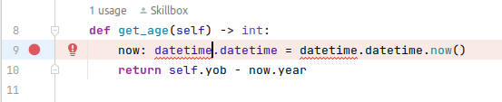
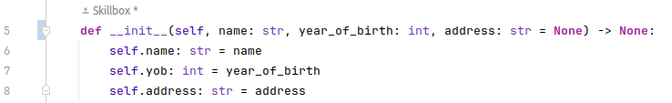

# Найденные ошибки и их исправления в модуле [person.py](person.py)

***
1.Не импортирована библиотека datetime
>  

##### Решение:

    import datetime

___    

2. Не верно применен метод set_name(). Не используется полученный параметр, место этого self.name ссылается на саму
   себя:

        def set_name(self, name: str) -> None:
           self.name = self.name

##### Решение:

          def set_name(self, name: str) -> None:
              self.name = name

3. В методе set_address() применер оператор сравнения, за место оператора присвоения:

       def set_address(self, address: str) -> None:
        self.address == address

##### Решение:

       def set_address(self, address: str) -> None:
        self.address = address

4. Метод is_homeless() не использует ссылку на экземпляр класса в результате чего будет вызвано исключение NameError:

       def is_homeless(self) -> bool:
        '''
        returns True if address is not set, false in other case
        '''
        return address is None

##### Решение:

> 
> > Изменить значение address на None для того что бы при присвоении self.address передавалаось значение None, а не пустая строка.
> > 
> >          def is_homeless(self) -> bool:
>>             """
>>             returns True if address is not set, false in other case
>>             """
>>             return self.address is None
> >> Перед переменной address дописать self для присвоения ссылки переменной на экземпляр класса.
> >> А так же необходимо изменить одинарные кавычки в документации на тройные 

