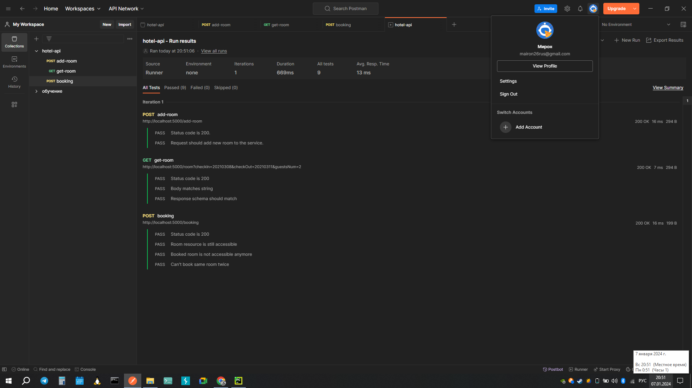

# Практическая работа, модуль 15
## TDD — разработка через тестирование.

##  Повышаем уровень зрелости
### 1. Определение текущий уровень зрелости:
>В ДЗ был применен 2 уровень зрелости так как сервисы данного API имеют несколько endpoints 
    имея более 1-го метода в своем [распоряжении.]( https://en.wikipedia.org/wiki/Richardson_Maturity_Model)
### 2. Обращено внимание на названия endpoint и параметров:
>Согласно [хорошей практике](https://www.linkedin.com/pulse/best-practices-rest-apis-sergey-idelson/) стоит избегать в
> названиях endpoints глаголы и существительные в единственном числе.
### 3. Изменённый контракт оформлен в виде Postman-коллекции.
#### [Изменения в контракте](hotel-api-v1.postman_collection.json):
1. Изменены названия endpoints согласно общим рекомендациям без применения глаголов и едн. числа существительного.
2. Добавлено применение версий <b>API</b>.
3. Добавлен endpoint  <b>./update-rooms/</b> для возможности изменения бронирования.
4. Добавлен endpoint <b>./cancel-rooms/</b>  для возможности отмены бронирования.
5. Отредактирован http status для [./booking/](https://developer.mozilla.org/ru/docs/Web/HTTP/Status/204) c 200 на 204.
6. Отредактирован http status для [/.new-rooms/](https://developer.mozilla.org/ru/docs/Web/HTTP/Status/201) с 200 на 201.