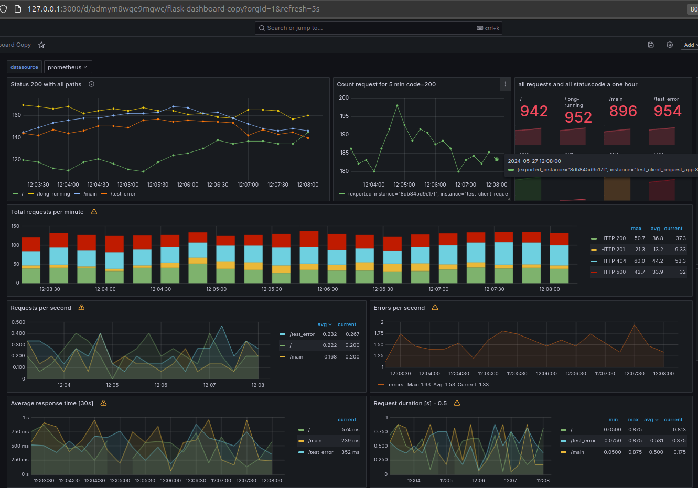
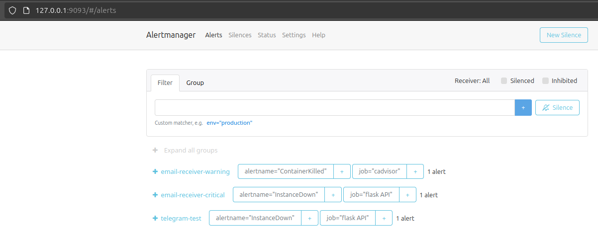
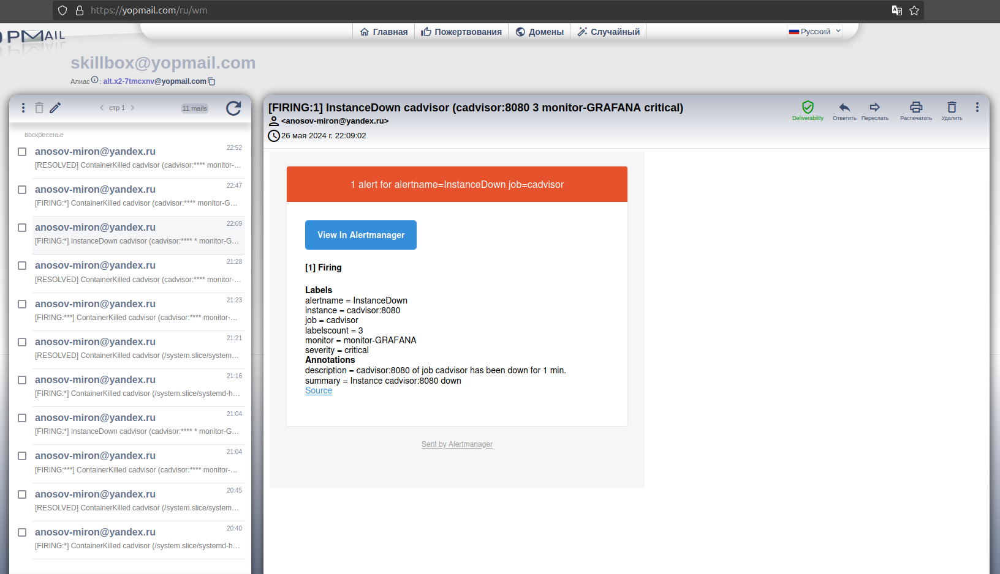
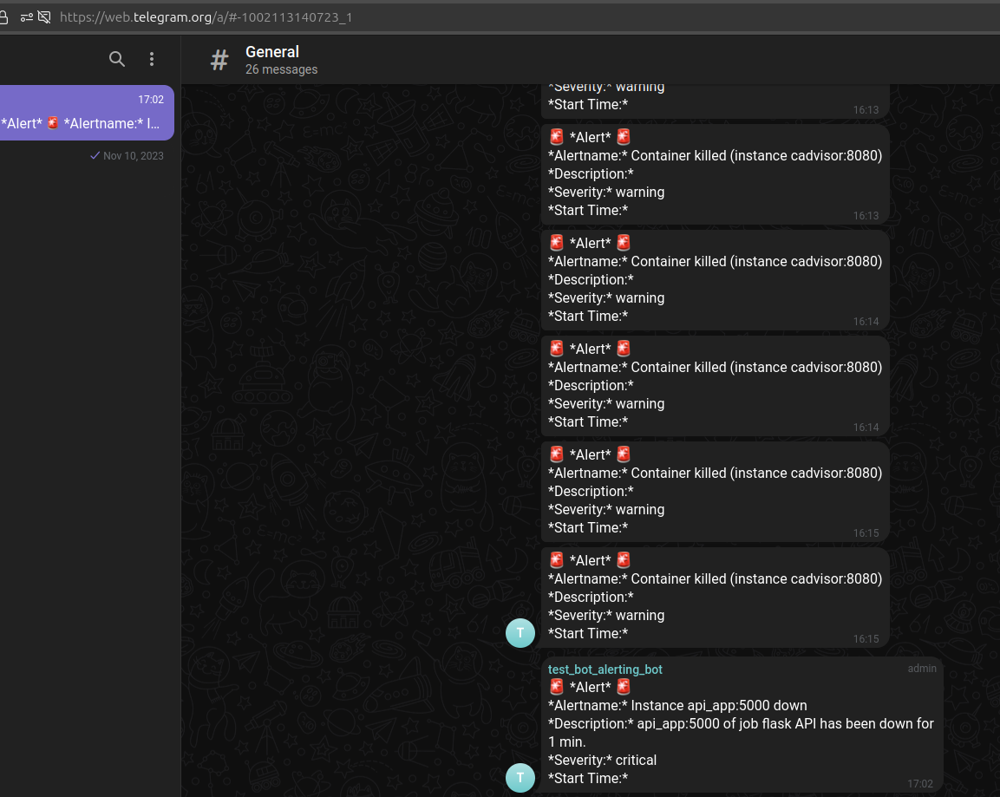

### Start:
```bash
cd ./.; docker compose ud -d
```
<br>

***
##### На эндпоинт необходимо добавить декоратор метрики @metrics.counter(), которая будет хранить счетчик запросов с кодом ответа 200

<br>




<br>

***
<br>


***
<br>



***
<br>

