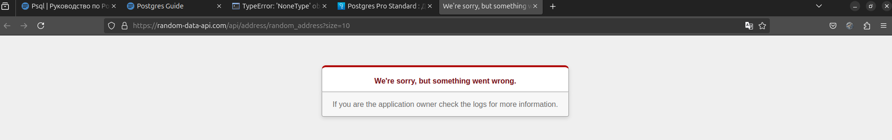

### Полезные ссылки:

- [before_first_request актуальна до flask = "2.0" с werkzeug = "2.3.8"](https://flask.palletsprojects.com/en/2.0.x/api/?highlight=before_first_re#flask.Flask.before_first_request)<br>
- [Функции и операторы для работы с массивами ](https://postgrespro.ru/docs/postgrespro/16/functions-array)<br>

#### Лежит 


### Create test_psql_table:
>Подключитесь к СУБД через psql и создайте базу данных skillbox_db, которая должна быть доступна юзеру, указанному в env-переменных.
```bash
cd .
source .env
docker run --rm --name api_db \
  -e POSTGRES_USER=$POSTGRES_USER \
  -e POSTGRES_PASSWORD=$POSTGRES_PASSWORD \
  -p 5544:5432 \
  -v postgres_storage:/var/lib/postgresql/data \
  -d  postgres:16.3
sleep 1
docker exec api_db psql -U $POSTGRES_USER \
  -c "CREATE DATABASE $POSTGRES_DB" \
  -c "\c $POSTGRES_DB" \
  -c "CREATE TABLE test_psql_table (ID INTEGER)" \
  -c "\dt" \
  -c "\q"
docker stop api_db 
```


### Run:
```bash

docker compose build && docker compose up 
```

### Endpoints:
<br>

#### POST: /clients

```bash
curl -X POST -H "Content-Type: application/json" -d '{
    "name": "John Smith",
    "has_sale": true,
    "address": 
    {"street": "1235 Main St", "city": "Anytown", "state": "ANY", "zip": "12345", "country": "USA"},
    "coffee_id":1 }' http://localhost:8000/coffeeshop/clients
```
#### Response:
```
{
  "address": {
    "city": "Anytown", 
    "country": "USA", 
    "state": "ANY", 
    "street": "1235 Main St", 
    "zip": "12345"
  }, 
  "coffee_id": 1, 
  "has_sale": true, 
  "id": 11, 
  "name": "John Smith"
}
```

<br>

#### GET : /look-for-coffee
```bash
curl -G "http://localhost:8000/coffeeshop/look-for-coffee" --data-urlencode "coffee_name=<КОФЕ>"
```
#### Response:
```
[
  {
    "id": 4, 
    "intensifier": "Medium roast", 
    "notes": [
      "Citrus", 
      "Berry", 
      "Floral"
    ], 
    "origin": "Kenya", 
    "title": "Kenyan Coffee"
  }
]
```

<br>

#### GET /unique-items
```bash
curl  "http://localhost:8000/coffeeshop/unique-items"
```
#### Response:
```
[
  "Balanced", 
  "Berry", 
  "Bright", 
  "Caramel", 
  "Chocolate", 
  "Citrus", 
  "Creamy", 
  "Delicate", 
  "Earthy", 
  "Floral", 
  "Fruity", 
  "Herbal", 
  "Honey", 
  "Jasmine", 
  "Nutty", 
  "Smooth", 
  "Spicy", 
  "Sweet", 
  "Tropical"
]
```

<br>

#### GET: /clients
```bash
curl -G "http://localhost:8000/coffeeshop/clients" --data-urlencode "country=USA"
```
#### Response:
```[
  {
    "address": {
      "city": "Somewhere Else", 
      "country": "USA", 
      "state": "ANY", 
      "street": "159 Oak Ave", 
      "zip": "13579"
    }, 
    "coffee_id": 5, 
    "has_sale": true, 
    "id": 5, 
    "name": "David Lee"
  }, 
  {
    "address": {
      "city": "Somewhere Else", 
      "country": "USA", 
      "state": "ANY", 
      "street": "852 Oak Blvd", 
      "zip": "13579"
    }, 
    "coffee_id": 9, 
    "has_sale": true, 
    "id": 9, 
    "name": "Alex Nguyen"
  }
]
```


#### Навигация:
```
.
├── app                          
│   ├── app.py                    # главный файл приложения для запуска сервера
│   ├── core                      
│   │   ├── controllers           
│   │   │   └── coffeeshop.py     # Контроллер для функциональности кофейни
│   │   ├── __init__.py           
│   │   ├── models_orm            
│   │   │   ├── crud.py           # реализация CRUD для работы с базой данных
│   │   │   ├── engine.py         # настройки и инициализация движка базы данных
│   │   │   ├── __init__.py       
│   │   │   ├── orm               
│   │   │   │   ├── basemodel.py  # базовая модель для всех ORM моделей
│   │   │   │   ├── coffee.py     # модель, представляющая кофе
│   │   │   │   └── user.py       # модель, представляющая пользователя
│   │   ├── services              
│   │   │   ├── data_if_api_fail.py # статичные данные в случае отказа API
│   │   │   ├── generator_data.py  # запрос данных со стороннего API для получения coffee и users
│   │   │   ├── make_valid_data.py # обработка и валидация сырых данных
│   │   ├── settings.py           # настройки приложения
│   │   └── validators            
│   │       ├── coffee_validate.py # валидация данных для кофе
│   │       ├── __init__.py        
│   │       └── user_validate.py   # валидация данных для пользователя
│   ├── __init__.py
├── .env.tamplate                 # образец конфигурации окружения                 
├── docker-compose.yml            # конфигурация для Docker Compose
├── Dockerfile                    # файл Docker для создания образа приложения
├── img_1.png                     # вечно падающий API
├── poetry.lock                   # файл блокировки зависимостей для Poetry
├── pyproject.toml                # конфигурационный файл для Poetry, содержащий зависимости и настройки проекта
└── README.md                     # документация для проекта

```